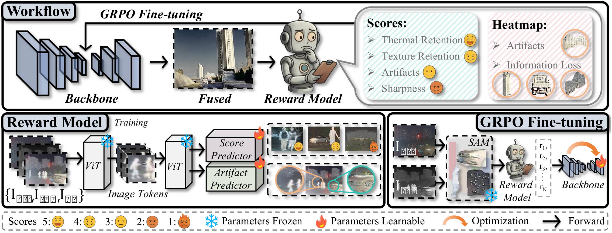
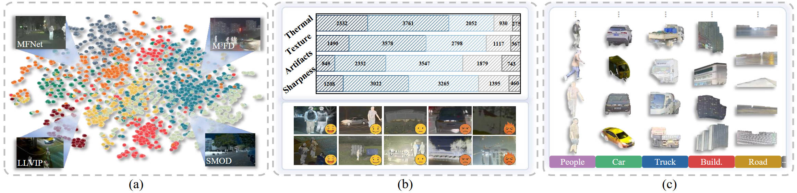
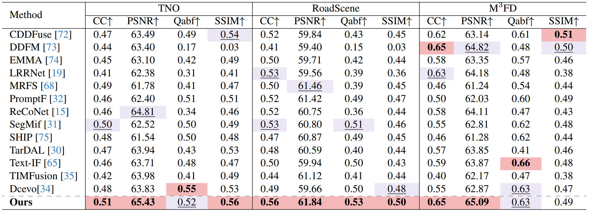
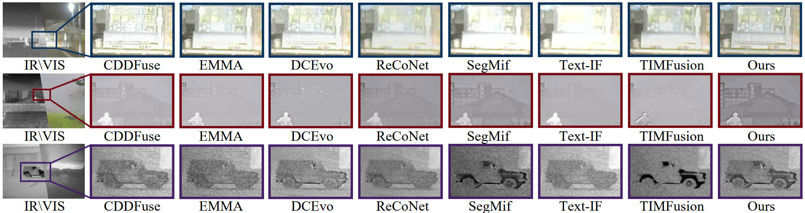

# EVAFusion

Jinyuan Liu, Xingyuan Li, Qingyun Mei, Haoyuan Xu, Zhiying Jiang, Long Ma, Risheng Liu, Xin Fan, **"Bridging Human Evaluation to Infrared and Visible Image Fusion"**,
IEEE/CVF Conference on Computer Vision and Pattern Recognition **(CVPR)**, 2026.



## Environment
```
conda env create -f environment.yml
```

## Dataset Show
This figure overviews the collected dataset, highlighting its data, label, and scene diversity.

The EVAFusion dataset is publicly available at Hugging Face Datasets:
👉 [https://huggingface.co/datasets/HHOODD/EVAFusion_dataset](sslocal://flow/file_open?url=https%3A%2F%2Fhuggingface.co%2Fdatasets%2FHHOODD%2FEVAFusion_dataset&flow_extra=eyJsaW5rX3R5cGUiOiJjb2RlX2ludGVycHJldGVyIn0=)



## Fusion Results
1. Quantitative comparison of infrared and visible image fusion between our DCEvo and state-of-the-art methods on M3FD, RoadScene, TNO and FMB datasets.




3. Qualitative comparisons of our DCEvo and existing image fusion methods. From top to bottom: low-light in TNO, high-brightness in RoadScene and low-quality in M3FD..



